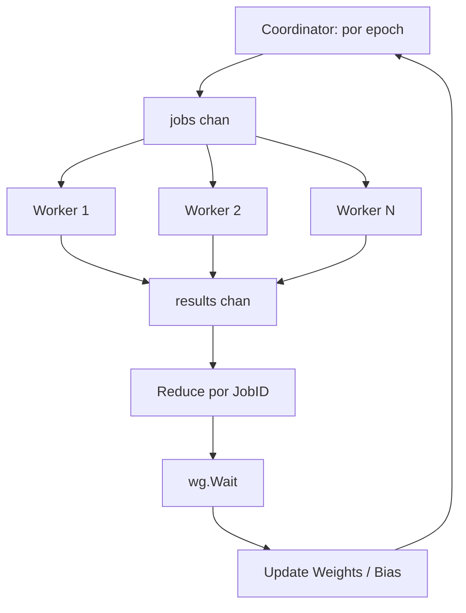

# 01 — Algoritmo concurrente

## Algoritmo secuencial

`trainSequential` (`sequential.go:5`) implementa Gradient Descent por
lotes (batch) para Regresión Lineal: en cada época recorre **todas**
las muestras de entrenamiento en un único hilo, acumula el gradiente
de cada peso y del bias, y al final de la época actualiza el modelo:

```
para epoch en 1..epochs:
    weightGradients, biasGradient, squaredErrorSum = 0
    para cada muestra en trainData:                        # sequential.go:43-58
        error, squaredError = accumulateSampleGradient(model, muestra, weightGradients)
        biasGradient += error
        squaredErrorSum += squaredError
    model.Weights -= learningRate * (2/n) * weightGradients # sequential.go:66-72
    model.Bias    -= learningRate * (2/n) * biasGradient    # sequential.go:74-77
```

Complejidad por época: O(n · features), con n = filas de entrenamiento.

## Algoritmo concurrente

`trainConcurrent` (`concurrent.go:60`) paraleliza el recorrido de las
muestras **dentro de cada época**, manteniendo la actualización de
pesos secuencial y determinista al final de la época:

```
Coordinator (por época)
     |
  jobs chan (buffered, tamaño = jobCount)        concurrent.go:104-105
     |
  Worker Pool (workerCount goroutines)            concurrent.go:114-123
     |  cada Worker: gradientWorker (concurrent.go:21-58)
     |    - lee jobs de su chunk [Start, End)
     |    - acumula gradiente PARCIAL y privado (localGradients, localBiasGradient)
     |    - NO toca model.Weights/model.Bias
     |
  results chan (buffered, tamaño = jobCount)      concurrent.go:107-108
     |
  Reduce (por JobID, orden determinista)          concurrent.go:150-163
     |
  wg.Wait()                                       concurrent.go:165
     |
  Update Weights (solo el Coordinator)             concurrent.go:167-205
```

Diagrama Mermaid equivalente:



### Particionamiento

- `jobCount = workerCount * 4` (`concurrent.go:82`), acotado a
  `len(trainData)` si es menor. Usar varios jobs por worker (4x)
  permite que el trabajo se reparta de forma más equilibrada que un
  job por worker cuando las últimas filas cuestan distinto que las
  primeras (aunque en este dataset el costo por fila es homogéneo, el
  4x da margen si la asignación se desbalancea por scheduling del
  runtime de Go).
- `chunkSize = ceil(len(trainData) / jobCount)` (`concurrent.go:125-127`);
  cada job cubre `[start, start+chunkSize)`, recortado al final del
  slice.
- Cada `GradientJob` (`concurrent.go:8-12`) lleva su `ID` y su rango
  `[Start, End)`.

### Por qué no hace falta un Mutex

Los Workers (`gradientWorker`, `concurrent.go:21-58`) **solo leen**
`model.Weights`/`model.Bias` (a través de `accumulateSampleGradient`,
en `regression.go`) y escriben en variables **locales y privadas** de
su propia goroutine (`localGradients`, `localBiasGradient`,
`localSquaredError`, `concurrent.go:32-36`). Nunca escriben el estado
compartido del modelo. El único punto de escritura de
`model.Weights`/`model.Bias` es el Coordinator, después de
`wg.Wait()` (`concurrent.go:165-205`), cuando **todos** los Workers ya
terminaron. No existe una región de memoria compartida con escritura
concurrente, por lo que un `sync.Mutex` sería redundante: la exclusión
mutua ya está garantizada por el diseño del pipeline (Worker Pool →
`wg.Wait()` → Update, en ese orden, una sola vez por época). El modelo
Promela (`02-modelo-promela.md`) verifica formalmente esta propiedad
con `ltl mutex`.

### WaitGroup + canales con buffer

- `sync.WaitGroup` (`concurrent.go:110-112,165`) asegura que el
  Coordinator no reduce/actualiza pesos hasta que **todas** las
  goroutines Worker terminaron de leer del canal `jobs` (canal
  cerrado con `close(jobs)`, `concurrent.go:148`, que hace que el
  `for job := range jobs` de cada Worker termine cuando se vacía).
- `jobs` y `results` son canales **buffered** con capacidad
  `jobCount` (`concurrent.go:104-108`), para que el Coordinator pueda
  encolar todos los jobs de la época sin bloquearse esperando a que
  un Worker los consuma, y para que los Workers puedan publicar su
  resultado sin bloquearse esperando a que el Coordinator lo lea.

### Reducción determinista

Los resultados se guardan indexados por `JobID`
(`partialResults[result.JobID] = result`, `concurrent.go:161-163`),
no en el orden de llegada. Como consecuencia, la suma de gradientes
parciales (`concurrent.go:173-189`) siempre se recorre en el mismo
orden (`jobID` ascendente) sin importar en qué orden terminaron los
Workers, y la suma en punto flotante da **el mismo resultado bit a
bit** en cada corrida — necesario para que
`TestConcurrentTrainingIsDeterministic` (`equivalence_test.go:79-107`)
se cumpla.

### Verificación de equivalencia

`verifyEquivalence` (`equivalence.go:11-23`) compara el modelo
secuencial contra el concurrente con `maxModelDifference` y una
tolerancia de `1e-9` (usada en `main.go:445-459` para `-mode=quick`/
`all`, y en los tests `equivalence_test.go`). Con esa tolerancia se
certifica que ambos algoritmos convergen al mismo modelo salvo error
de punto flotante — el paralelismo NO cambia el resultado matemático,
solo el tiempo de cómputo.
